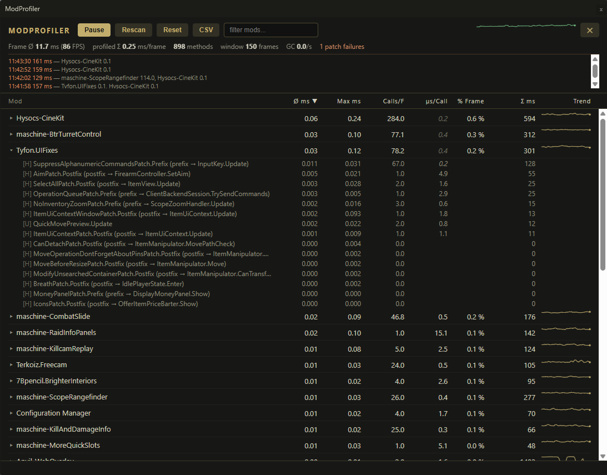

# maschine-ModProfiler

In-game profiler for SPT modeled after **Dubs Performance Analyzer** (RimWorld):
shows live how much CPU time each installed client mod costs per frame — to find the
culprit behind performance drops without having to disable mods one by one.



## Usage

- **F11** (configurable): open/close the profiler. The first activation instruments
  all mod code and can freeze the game for a few seconds — that is normal.
- If the [Anvil-WebOverlay](https://github.com/maschine34675/WebOverlay) library is
  installed (1.8.0 or newer), the profiler opens as **its own window on top of the
  game** (HTML UI):
  draggable with remembered position/size, sorting via column headers, filter field,
  per-mod trend sparklines and a frame history in the header. **Esc** or the toggle key
  closes it. A mouse mode is unnecessary here: while the window has focus it captures
  mouse and keyboard itself; one click into the game returns both.
- Without the library — or with `UI/PreferWebOverlay = false` — the previous
  **IMGUI overlay** appears. There, the mouse cursor is left untouched on opening and you
  can keep playing normally. The **"Mouse"** button in its toolbar activates mouse mode:
  cursor free, all game controls blocked (shooting, movement, mouse look), so you can
  safely click inside the window; the same button switches back. If that block could not
  be installed — a game update changed what it hooks — the mod says so in the log at
  startup; the cursor is still freed, but the game keeps reacting.
  In menus (cursor already free), hovering over the window is enough: clicks then no
  longer reach the game UI underneath.
- Table: one row per mod with **avg ms/frame**, **max ms**, **calls/frame**, **% frame**
  and **Σ ms** (accumulated since activation). Clicking a column header sorts.
  The web window additionally shows **µs/call** (average cost of a single call):
  values close to 1 µs consist mostly of the measurement overhead of the instrumentation
  itself — such rows are grayed out, and their ranking is not reliable either. In the
  web window, all column headers, metrics and buttons also explain themselves via
  tooltips.
- Clicking a mod name expands the mod's most expensive methods
  (`[H]` Harmony patch, `[U]` Unity frame method, `[C]` coroutine/async).
- The web window's header also shows the **GC rate** (collections per second; amber
  ticks on the frame graph mark intervals in which a collection ran), and a **spike
  log** records frames slower than `UI/SpikeThresholdMs` (default 30 ms, and at least
  1.5× the current average) together with the top measured contributors of that exact
  frame — a spike without contributors points at the engine or the GC.
- **Pause/Resume**: stop measuring, window stays open. **Rescan**: picks up patches
  created later (e.g. at raid start — press it once during the raid!).
  **Reset**: zero the counters. **CSV**: export to
  `BepInEx/plugins/maschine-ModProfiler/modprofiler-<time>.csv`.

## What is measured

1. **Harmony patches**: every prefix/postfix/finalizer method a mod has patched onto the
   game is itself wrapped with a stopwatch via Harmony and attributed to the assembly
   (= mod).
2. **MonoBehaviours**: `Update`/`FixedUpdate`/`LateUpdate`/`OnGUI` of all components
   defined in mod assemblies.
3. **Coroutines & async**: `MoveNext` of the compiler-generated state machines from
   mod assemblies.

## Limits (important for interpretation)

- **Transpilers** run only once, at patch time; their runtime cost lives inside the
  original method and cannot be attributed.
- **Indirect costs** are not captured: a mod that spawns more bots or generates more loot
  causes load in the game engine (AI, rendering, GC), not in its own code.
  If everything is green here but FPS still drop, it is caused by such mods or by the
  base game — then compare with the mod on/off, or use the SimpleMonoProfiler from
  [BepInEx.Debug](https://github.com/BepInEx/BepInEx.Debug).
- **GC runs** are not reported separately. A blocking GC in the middle of a measured
  method lengthens its sample — occasional max outliers can therefore be the GC,
  not the method. The web window's GC rate and the amber ticks on the frame graph
  make this case visible.
- Times are **inclusive**: if measured code calls other measured code, the time counts
  twice; the sum can therefore exceed 100% of a frame. This also applies across mods —
  a measured prefix of mod B on a measured method of mod A counts in both rows.
- **Off-thread work** (async continuations, worker threads) is attributed to the next
  rendered frame — max and % frame can then look high without that frame actually
  having been blocked.
- **One-time lifecycle methods** (Awake/Start/OnEnable/OnDestroy) are not captured —
  a mod's loading and raid-start spikes stay invisible.
- The **instrumentation persists until the game is restarted**: even with the window
  closed or paused, all captured methods keep their (small) Harmony detour;
  only the timing itself is skipped. For before/after measurements of other mods,
  restart once without opening the profiler.
- **Patch failures** (the amber counter in the header) are methods Harmony could not
  wrap — most often because another mod's patch on the same method already uses a
  `__state` of a different type. The originals are untouched, but their cost is
  invisible here, so such a mod looks cheaper than it is. In the web window the
  counter is clickable and lists mod, method and Harmony's reason.
- Very small patch methods may have been inlined by the Mono JIT and then show up
  with 0 ms — but they are not the problem anyway.
- The instrumentation itself costs about a microsecond per measured call, so every
  value is slightly inflated. For a mod whose methods are called rarely that is noise
  and the ranking holds; for one called tens of thousands of times per frame the
  overhead can be most of its row and push it up the table. The web window's
  **µs/call** column is what tells the two apart — a value near 1 µs means you are
  largely looking at the profiler's own cost.

## Requirements and compatibility

- **SPT:** built and tested on 4.1.x, single player. Client-side only, no server
  component. Only one piece touches the game itself — the input mute described under
  Usage looks up `EFT.InputSystem.InputManager` by name — so a game update can disable
  that one feature (a warning appears in the log); the profiling itself keeps working.
  Other SPT lines are untested.
- **Optional:** [Anvil-WebOverlay](https://github.com/maschine34675/WebOverlay) 1.8.0
  or newer for the web window. Without it — or with an older version, which is
  reported in the log — the built-in IMGUI overlay is used instead. The web window
  additionally needs the Microsoft WebView2 runtime, which current Windows 10 and 11
  installations already include, and borderless windowed or windowed mode.
- **Fika (co-op):** not tested. The mod only measures and draws locally; it changes
  no game state and sends nothing over the network.

## Installation

Extract the zip over the SPT game directory (contains
`BepInEx/plugins/maschine-ModProfiler/`). Nothing else to set up: the profiler stays
idle until you press its hotkey.

## Configuration

Through the in-game config manager, or `BepInEx/config/com.maschine.ModProfiler.cfg`:

In the order the F12 menu shows them:

| Option | Default | Meaning |
|---|---|---|
| `General/ToggleOverlay` | F11 | Opens and closes the profiler. |
| `UI/PreferWebOverlay` | on | Use the web window when the library is installed. Read once at startup. |
| `UI/RefreshInterval` | 0.5 s | Seconds between table refreshes. |
| `UI/TopMethodsPerMod` | 15 | How many methods an expanded mod row lists. |
| `UI/SpikeThresholdMs` | 30 ms | Frames slower than this enter the spike log; 0 disables it. |
| `Profiling/HarmonyPatches` | on | Measure the Harmony patches other mods applied. |
| `Profiling/MonoBehaviours` | on | Measure mod `Update`/`FixedUpdate`/`LateUpdate`/`OnGUI`. |
| `Profiling/CoroutinesAndAsync` | on | Measure coroutine and async state machine steps. |
| `Profiling/IncludeSptCorePlugins` | on | Also profile the SPT core plugins. |

Two things do not take effect immediately. `UI/PreferWebOverlay` is read once at
startup, so changing it mid-session does nothing — restart the game. And changing
`Profiling/*` only affects methods that have not been instrumented yet; instrumentation
already applied also stays until the game restarts.

## Support

Report problems on the [issue tracker](https://github.com/maschine34675/ModProfiler/issues)
with your exact ModProfiler and SPT versions, what you expected and what happened,
short reproduction steps, and your complete `BepInEx/LogOutput.log` — not thousands of
pasted lines. A CSV export (the **CSV** button) is the most useful attachment for
anything about the numbers themselves.

## Build

```
dotnet build -c Release
```

The project resolves BepInEx, Harmony and the Unity assemblies relative to `SptRoot`,
which defaults to two directories up from the project file — so a checkout at
`<your SPT folder>/Development/ModProfiler` resolves it automatically. A checkout
anywhere else needs `/p:SptRoot=<your SPT folder>` on the command line (or as an
MSBuild property in your IDE). The optional `Anvil-WebOverlay.dll` reference resolves
from `$(SptRoot)/BepInEx/plugins/Anvil-WebOverlay/`; without that library installed the
build fails, since the web window is compiled against it (it stays optional at runtime).

A successful build copies the DLL to `$(SptRoot)\BepInEx\plugins\maschine-ModProfiler\`
and creates the release zip next to the project file.

## License and credits

MIT, see [LICENSE](LICENSE). The approach — wrapping other mods' Harmony patches with
a stopwatch instead of profiling the engine — is taken from **Dubs Performance
Analyzer** for RimWorld; no code is shared with it. For what this profiler cannot see,
the **SimpleMonoProfiler** from [BepInEx.Debug](https://github.com/BepInEx/BepInEx.Debug)
is the complement.
